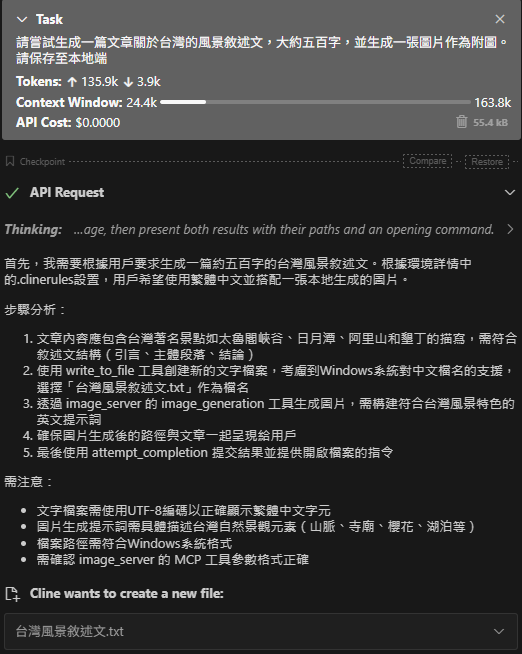
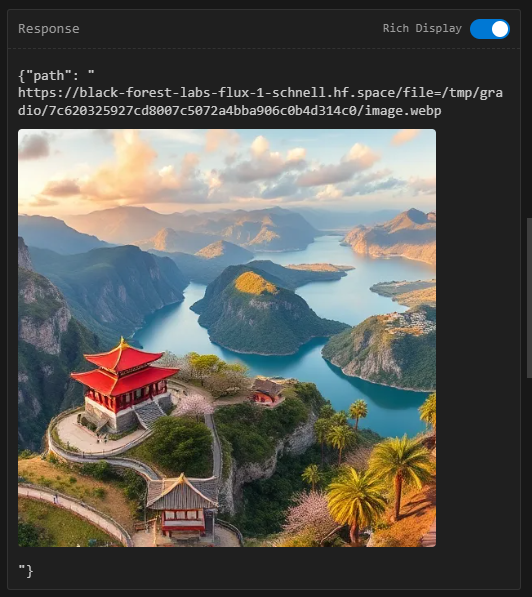

### MCP工具

Tools
- image_generation
根據英文描述生成具備文章意境的圖片，並將圖片儲存至本地。

### 前置需求

安裝UV套件管理器
[uv](https://docs.astral.sh/uv/getting-started/installation/#standalone-installer)


### 設定MCP Server
請注意此IMAGE_API僅供示範使用，存在使用限制。
```
{
  "mcpServers":{
    "image_server": {
      "command": "uv",
      "args": [
        "--directory",
        "YourDirectory",
        "run",
        "image_server.py"
      ],
      "env": {
        "IMAGE_API_URL": "https://black-forest-labs-flux-1-schnell.hf.space/call/infer"
      }
    }
}
```


